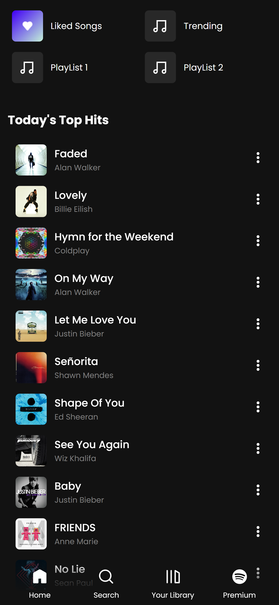
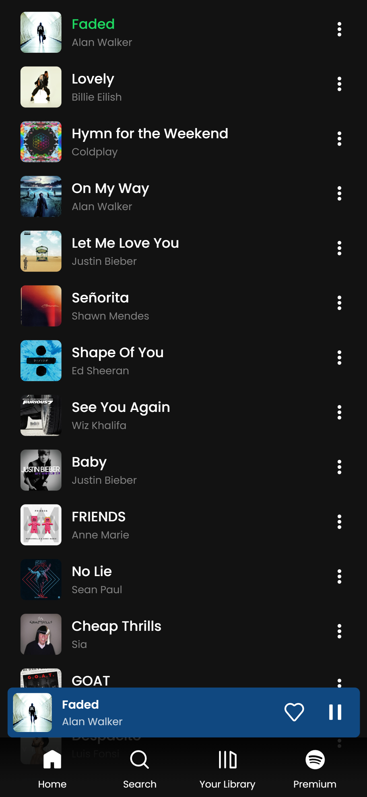
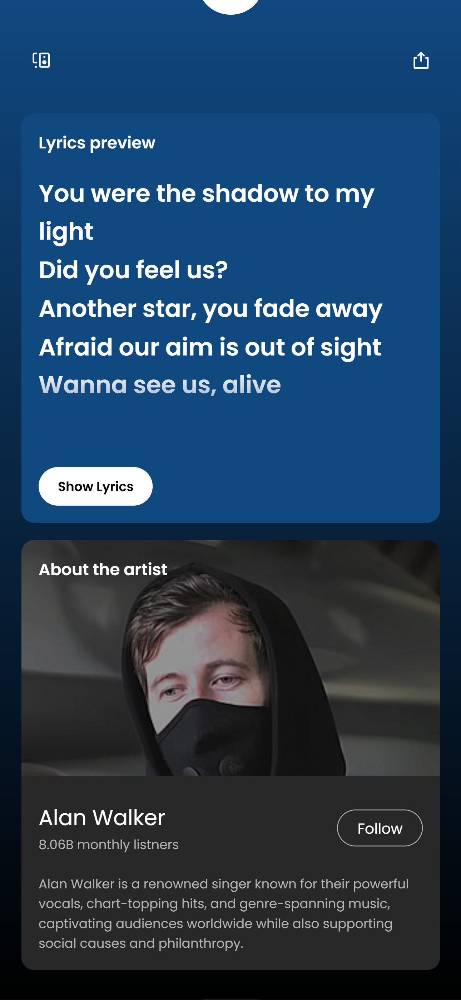
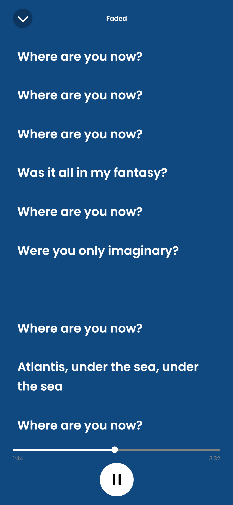

# Spotify Clone - Web Music Player 🎵


## 🚀 Overview

Welcome to the **Spotify Clone**, a modern and responsive web music player that allows users to stream their favorite songs seamlessly. Built with **HTML, CSS, and JavaScript**, this project is designed to provide a sleek and intuitive music streaming experience.

## 🌟 Features

- 🎧 **Music Streaming** - Play songs with smooth audio playback.
- 📂 **Preloaded Songs** - Enjoy a collection of popular tracks.
- 📱 **PWA Support** - Installable as a Progressive Web App.
- 🎨 **Dynamic UI** - Auto-adjusts theme color based on the song.
- 🎵 **Lyrics Fetching** - Displays song lyrics using Genius API.
- 🔄 **Swipe Gestures** - Touch-friendly navigation for mobile users.
- 📑 **Playlist Management** - Categorized song lists like 'Liked Songs' and 'Trending'.

## 🖥️ Live Demo

🔗 [Try the Spotify Clone](https://mohammadsameer01.github.io/spotify/)

## 📸 Screenshots








## 🛠️ Technologies Used

- **HTML** - Structure and content
- **CSS (Flexbox & Grid)** - Responsive and modern UI
- **JavaScript (ES6+)** - Dynamic interactions
- **Manifest.json** - PWA support
- **Genius API** - Lyrics fetching

## 📥 Installation

1. Clone the repository:

   ```bash
   git clone https://github.com/mohammadsameer01/spotify.git
   ```
